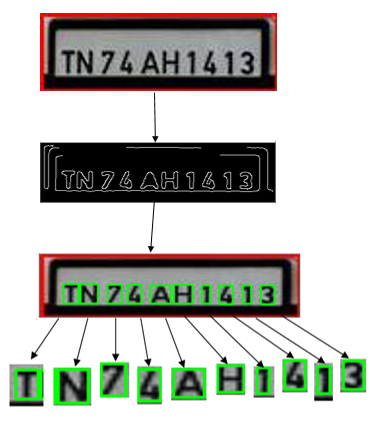

# ANPR-using-Image-Processing-and-Deep-Learning
The ANPR algorithm uses yolo to detect number plates. The cropped image of the detected number plates are then pre-processed to highlight only individual characters (numbers and alphabets). A trained CNN model then converts previously identified characters into text format.

# Outputs
1. Image of a car with visible number plate:

2. Detected Numberplate:

3. Detected Characters:

Detected number plate values in text format: TN74AH1413

# Contributor Contact:
1. Rajdeep Adak (rajdeep.adak@somaiya.edu).
2. Abhishek Kumbhar (abhishek.kumbhar@somaiya.edu).
3. Rajas Pathare (rajas.pathare@somaiya.edu).
4. Sagar Gowda (sagar.gowda@somaiya.edu).
